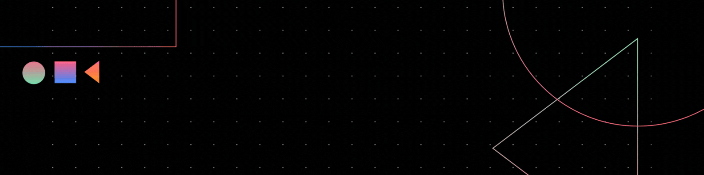

### Hi there 👋

<!-- **Cebucoder/Cebucoder** is a ✨ _special_ ✨ repository because its `README.md` (this file) appears on your GitHub profile. -->

 
 
  

 

<!-- About Section -->

# About me

 
 💻 &emsp; Enjoy to do programming and sharing knowledge   
 ❤️ &emsp; Love to writing code and learning new features  
 <!-- 📧 &emsp; Reach me anytime: Cebucoder.dev@gmail.com   -->

 
 
 

## Use To Code

 

## Top Open Source:

  

 

 

  

<a> 
    
  
   
</a>

<!--
- 👯 I’m looking to collaborate on ...
- 🤔 I’m looking for help with ...
- 💬 Ask me about ...
- 📫 How to reach me: ...
- 😄 Pronouns: ...
- ⚡ Fun fact: ... -->
